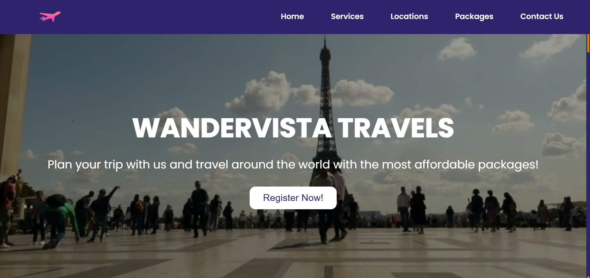
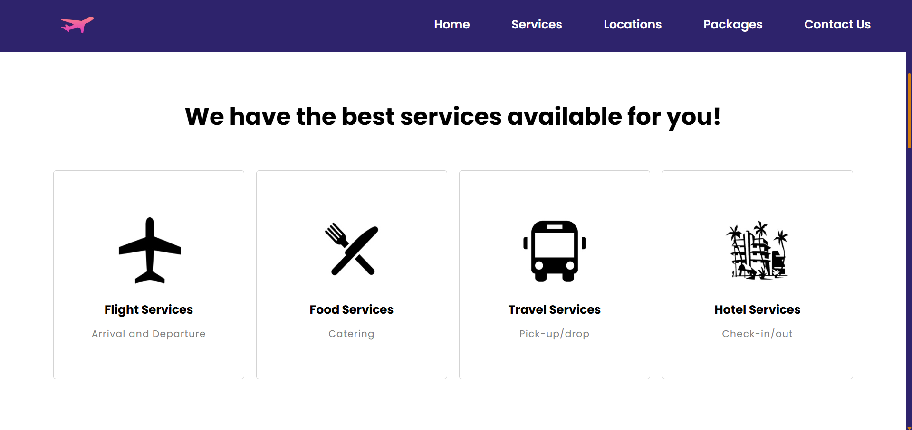
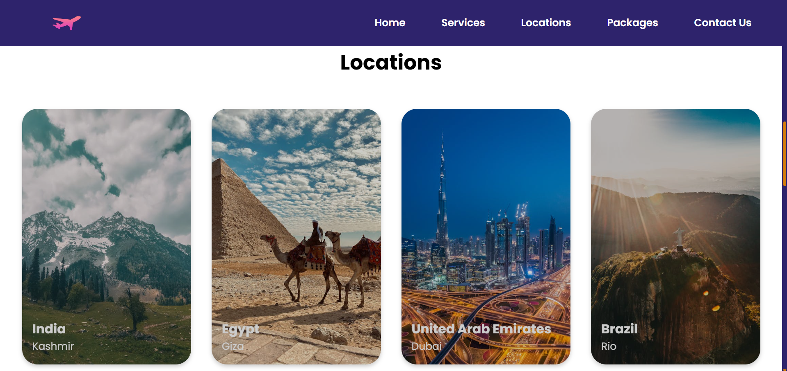
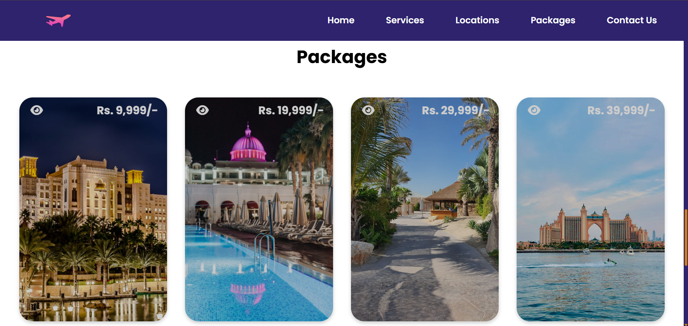

# 🌏 WanderVista Travels – Travel Website

Welcome to **WanderVista Travels**, a modern and beautifully designed travel website where users can explore global destinations and book travel packages with ease. <br />
The website provides a smooth browsing experience with sections for flights, accommodations, food & catering, travel assistance, and exclusive packages — offering everything a traveler needs for a perfect trip.

---

## 📸 Screenshots

| Preview 1 | Preview 2 |
|------------|------------|
|  |  |

| Preview 3 | Preview 4 |
|------------|------------|
|  |  |

---

## 🌐 Live Demo

You can view the live demo of this project here: [WanderVista Website](https://travel-website-topaz-eight.vercel.app/)

---

## 🚀 Tech Stack

- **HTML5**
- **CSS3**
- **JavaScript**
- **Font Awesome** (for icons)

---

## 💻 Features

- 📱 Fully Responsive Layout – Optimized for all devices
- 🌐 Interactive Navigation Menu – Smooth and user-friendly
- 🏔️ Hero Section – Beautiful imagery and strong call-to-action
- 🧳 Services Section – Highlights flight, hotel, food & travel services
- 📍 Locations Section – Explore stunning travel destinations
- 🎒 Packages Section – Attractive cards presenting travel packages
- 💬 Contact Form – Easy way for users to reach out
-⭐ Font Awesome Icons – Clean and modern visual elements

---

## 🛠️ How to Use

1. Clone the repository:

   ```bash
   git clone https://github.com/TonyStark-19/Travel-Website.git
   ```

2. Navigate into the project folder:

   ```bash
   cd Travel-Website
   ```

3. Open `index.html` in your browser.
---

## 👨‍💻 Author

Made with ❤️ by **Aditya Chandel** <br />
If you liked this project, consider giving it a ⭐ on GitHub!
