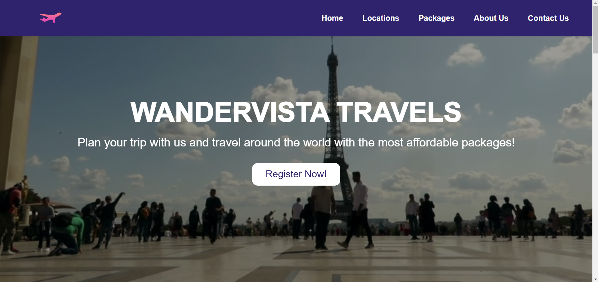

# WanderVista Travels - Travel Website

## Table of Contents
- [Overview](#overview)
- [Screenshots](#screenshots)
- [Key Features](#key-features)
- [Technologies Used](#technologies-used)
- [Features](#features)

## Overview
Welcome to **WanderVista Travels**, a modern travel website that allows users to explore and book travel packages across various exciting destinations around the world. The site is designed with a sleek user interface that provides flight services, food and catering, hotel booking, and travel assistance, ensuring a hassle-free experience for travelers.

## Screenshots
### Homepage : 

### Key Features
- **Video Background**: A captivating video plays in the background to draw attention as soon as users land on the homepage.
- **Responsive Navigation**: Smooth and responsive navigation for users to easily explore sections like *Home*, *Locations*, *Packages*, *About Us*, and *Contact Us*.
- **Travel Services**: Offers a variety of services, including Flight, Food, Travel, and Hotel accommodations.
- **Popular Destinations**: Showcases popular travel destinations such as India, Egypt, Dubai, Brazil, USA, Japan, Russia, and France.
- **Affordable Packages**: Different travel packages (Bronze, Silver, Gold, and Platinum) catering to various budgets.
- **Newsletter Subscription**: Users can subscribe to receive weekly updates on travel offers and news.

## Technologies Used
- **HTML5**: Structure and content of the website.
- **CSS3**: Styling for layout, colors, fonts, and animations.
- **Font Awesome**: Used for social media and service icons.
- **Video Integration**: For immersive background effects.

## Features
- **Travel Services**: Display of various services such as flights, food, and travel assistance, each with its own dedicated image and description.
- **Popular Locations**: A grid of destinations users can choose to explore, including images and short descriptions.
- **Packages**: Different travel packages for users, ranging from budget-friendly to luxurious.
- **Subscription**: Users can sign up for a newsletter to get the latest deals.
