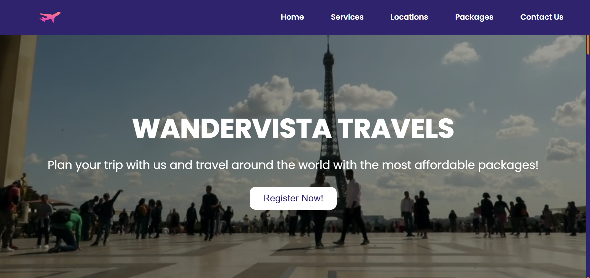

# WanderVista Travels - Travel Website 🌏

## Overview
Welcome to **WanderVista Travels**, a modern travel website that allows users to explore and book travel packages across various exciting destinations around the world. The site is designed with a sleek user interface that provides flight services, food and catering, hotel booking, and travel assistance, ensuring a hassle-free experience for travelers. This project is a fully responsive website built using **HTML, CSS, and JavaScript**. It features a modern design with a **menu toggle functionality** and **interactive package boxes**.

---

## 📌 Demo

You can view the live demo of this project here: [WanderVista Website](https://travel-website-topaz-eight.vercel.app/)

---

## 📷 Screenshots
### Homepage : 

---

## 📌 Features

- ✅ **Fully Responsive** – Works seamlessly on all screen sizes.  
- ✅ **Menu Toggle Logic** – Implemented using JavaScript.  
- ✅ **Animated Package Boxes** – Interactive elements created using JavaScript & CSS animations.  
- ✅ **Modern & Clean UI** – Aesthetic design with smooth animations.  

---

## 🛠️ Technologies Used

- **HTML** – Structure of the website  
- **CSS** – Styling and animations  
- **JavaScript** – Menu toggle and dynamic package interactions  
- **Font Awesome**: Used for social media and service icons.
- **Video Integration**: For immersive background effects.

---

## 📩 Feedback & Contributions

- Feel free to fork this project and submit a pull request!
- If you find any bugs or have suggestions, open an issue.
- If you like this project, please give it a ⭐ on GitHub! 

---
